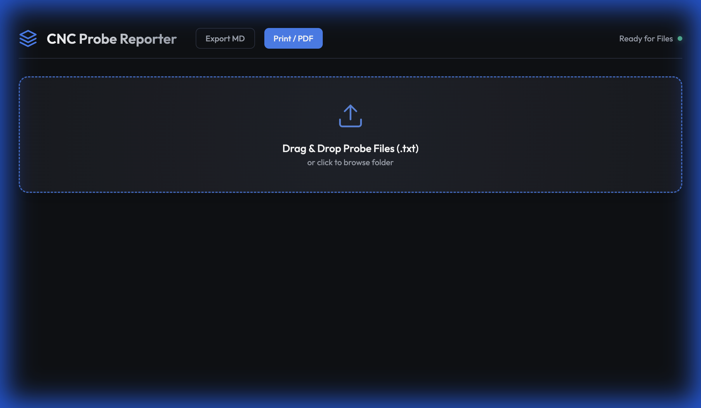

# CNC Probe Reporter Walkthrough

## Overview
We have created a local web application to analyze your Okuma CNC probe result files.
**No installation is required.** The app runs directly in your web browser.

## How to Use
1.  **Open the App**: Double-click the `index.html` file in the folder. It will open in your default browser (Chrome, Edge, etc.).
2.  **Load Files**:
    *   **Drag & Drop**: Select all the `.txt` files for a job (e.g., `207269-01.txt` through `207269-07.txt`) from your file explorer and drag them onto the "Drag & Drop" zone in the browser.
    *   **Click to Browse**: Alternatively, click the drop zone to open a file selection dialog.

3.  **View Results**:
    *   The dashboard will instantly load.
    *   **Job Overview**: Shows the Job ID and number of files.
    *   **Status**: A donut chart shows the ratio of Pass (Green) vs Fail (Red).
    *   **Statistics**: View the Average, Range, Max, and Min height (`V78`) for the batch.
    *   **Tolerance Check**: The app checks if the range (Max - Min) is within 0.005".
        *   **Pass**: Green checkmark.
        *   **Fail**: Red cross. The parts with the Max and Min values will be highlighted in red in the table below to help you find the outliers.
    *   **Graph**: The main chart visualizes the height of each part in sequence.
    *   **Table**: Full detailed list of every file processed.
4.  **Export/Print**:
    *   **Export MD**: Downloads a `report.md` file suitable for documentation.
    *   **Print / PDF**: Opens the print dialog. You can save as PDF or print a hard copy. The layout is optimized for printing (hides buttons and upload zone).
    *   **New Dataset**: Click this to clear the current results and load a new batch of files without refreshing the page.

## Technical Details
*   **Technologies**: HTML5, CSS3, JavaScript (Vanilla).
*   **External Library**: Chart.js (via CDN) for visualization.
*   **Data Layout**:
    *   Pass = `PassFail Enum: 1`
    *   Fail = `PassFail Enum: 4`
    *   Height = `V78` value
    *   Sorting = Files are automatically sorted by the suffix number (e.g. -01, -02).

## Next Steps
*   Try it with a real batch of files.
*   If you need to analyze a different folder, just refresh the page.
